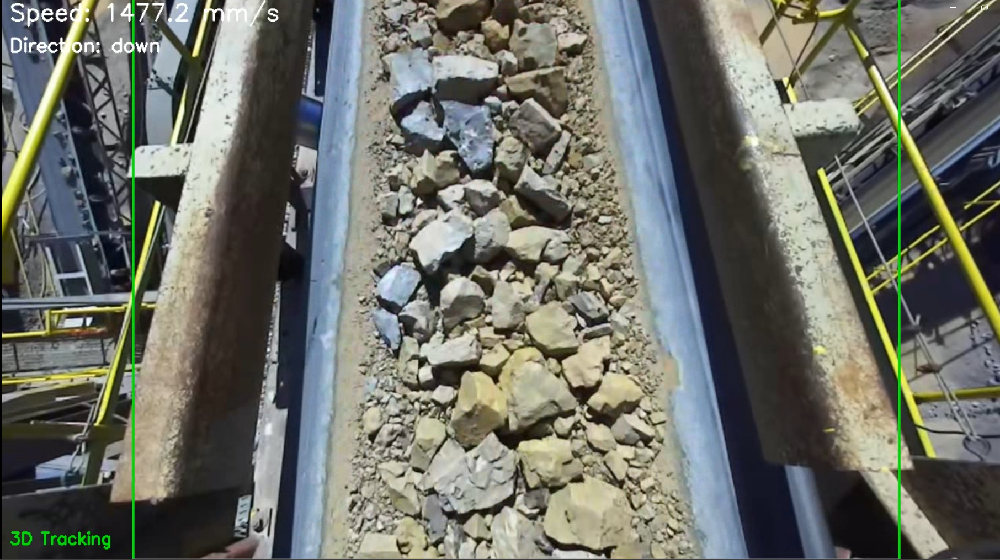
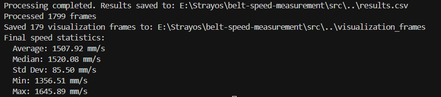

# Belt Speed Measurement System

Automatic conveyor belt speed measurement using ZED camera data, achiving:
- **Automatic ROI/Direction Detection**:  Finds belt region and moving direction using depth + motion analysis  
- **Real-time Speed Measurement**: Optical flow tracking with depth masking  
- **Stopped Belt Detection**:  Handles stationary belts correctly  
- **Frame-by-Frame Logging** : Outputs `results.csv` with timestamps  

Demo in: [link](https://drive.google.com/file/d/1qWR8-7YAV6XU0sYz39lUvr57zceSWf--/view?usp=drive_link)

## Files
```
belt-speed-measurement/
├── data/belt_sample.svo              # Input video
├── src/
│   ├── auto_roi_detector.py          # ROI detection (standalone)
│   └── belt_speed_measurement.py     # Speed measurement
├── venv/                                               #Python Virtual Environment
├── auto_roi_detection.json           # ROI config
├── belt_analysis_visualization.mp4          # Speed Measurements Demo
├── requirements.txt               # Python Dependencies
├── auto_roi_detection.json           # ROI config
└── results.csv                       # Speed Measurements Log
```

## Installation & Setup
**1. Environment Setup**
```bash
git clone <repository-url>
cd belt-speed-measurement

# Prepare virtual environment
python -m venv venv
.\venv\Scripts\activate          # Windows
# source venv/bin/activate       # Linux/Mac

# Install dependencies
pip install -r requirements.txt
```

**2. ZED SDK Installation**
```bash
# Download and install ZED SDK 4.x+
# Visit: https://www.stereolabs.com/developers/release/

# Install ZED Python API (after SDK installation)
cd "C:\Program Files (x86)\ZED SDK\python"  # Windows default path
python get_python_api.py

# Verify installation
python -c "import pyzed.sl; print('ZED Python API installed successfully')"
```
  
## Quick Start
```bash
# Activate virtual environment
.\venv\Scripts\activate
  
# 1. Auto-detect belt region and direction
python src/auto_roi_detector.py
  
# 2. Fix direction if needed (optional)
python src/auto_roi_detector.py --set-direction left
  
# 3. Measure speed
python src/belt_speed_measurement.py
```

## How It Works
 **1. ROI Detection** (`detect_belt_region_with_depth()`)
- **Purpose:** Automatically finds the belt's rectangular region in the camera view.
- **Process:**
	1. **Depth Analysis** (`analyze_depth_distribution()`): Finds belt surface depth from multiple frames
	2. **Depth Masking** (`create_depth_mask()`): Creates mask of pixels at belt depth  
	3. **Contour Detection**: Uses `cv2.findContours()` to find belt boundaries
	4. **ROI Refinement**: Analyzes pixel density to get precise belt rectangle
- **Output:** `{"x": 160, "y": 0, "width": 948, "height": 720}` with confidence score
- **Result Display**


**2. Direction Detection** (`detect_direction_interactive()`)
- **Purpose:** Determines which way the belt is moving (up/down/left/right).
- **Process:**
	1. **Frame Collection** - Loads 3 frames from SVO file
	2. **Motion Analysis** (`simple_motion_analysis()`) - Uses optical flow between frame pairs
	3. **Angle Calculation** - Converts motion vectors to degrees (0-360°)
	4. **Direction Mapping** - Maps angles to directions: 45-135° = "down", 135-225° = "left", etc.
- **Output:** Direction string ("down", "left", "right", "up") based on average motion angle
- **Result Display**




 **3. Speed Measurement** (`calculate_speed_optical_flow()`)
- **Purpose:** Measures real-time belt speed using optical flow tracking within the detected ROI.
- **Process:**
	1. **Feature Detection** (`detect_features_with_depth()`): Finds trackable points on belt surface using depth masking
	2. **Optical Flow Tracking**: Uses Lucas-Kanade algorithm (`cv2.calcOpticalFlowPyrLK()`) to track feature movement
	3. **Motion Vector Analysis**: Calculates displacement vectors between consecutive frames
	4. **Noise Filtering**: Removes motion < 0.5 pixels and uses median of vectors for robustness
- **Output:** Speed in mm/s with both raw and smoothed measurements

**4. Noise Handling** (`smooth_speed()`)
- **Spatial Filtering**: 0.5-pixel threshold removes sub-pixel noise and camera shake
- **Depth-Based Filtering**: Only tracks features on belt surface, excludes background noise
- **Temporal Smoothing:**: 10-frame median buffer smooths measurements over time
- **Stopped Belt Detection**: Smoothed speed reaches 0 within 5-10 frames after raw belt speed detected as 0 mm/s